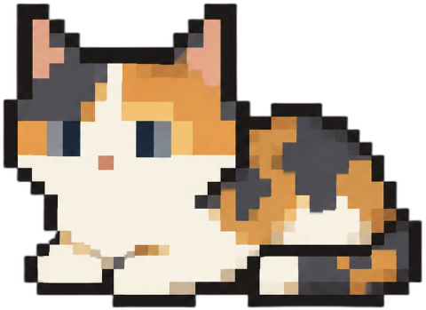

# 🐱 Desktop Pet

A little pet that lives on your screen and follows you around — built for macOS.

The pet roams inside whichever window you're currently using, wanders on its own, and runs to wherever you click. A tiny house icon sits in the corner of your window — click it to send the pet home and quit.



## Features

- Stays inside your active window and updates when you switch apps
- Wanders around on its own between clicks
- Runs to wherever you click (faster than wandering)
- All parameters are adjustable, including pet size, wander speed, wander interval, and chasing speed
- Upload your own pet photo and background is removed automatically
- House button in the top-right corner of your window and click to quit

## Setup

```bash
pip install PyQt6 pynput pyobjc-framework-Quartz pyobjc-framework-Cocoa rembg
python pet.py
```

> macOS may ask for Accessibility permission the first time (needed for click tracking). Go to System Settings → Privacy & Security → Accessibility and enable it.

## Usage

1. Run `python pet.py`
2. A settings window appears — adjust speed and size, and upload a photo of your pet
3. Click **Launch Pet**
4. Click anywhere on screen to make the pet run there
5. Click the house icon (top-right of your window) to send the pet home and exit

## Customisation

| Setting | What it does |
|---|---|
| Wander Speed | How fast the pet strolls on its own |
| Chase Speed | How fast it runs to your click |
| Wander Interval | How often it picks a new random spot |
| Size | Height of the pet in pixels |

Upload a **Rest** photo (required) and up to 3 **Walk** photos. 

## Requirements

- macOS (window detection uses Quartz / AppKit)
- Python 3.10+
- PyQt6, pynput, pyobjc, rembg
